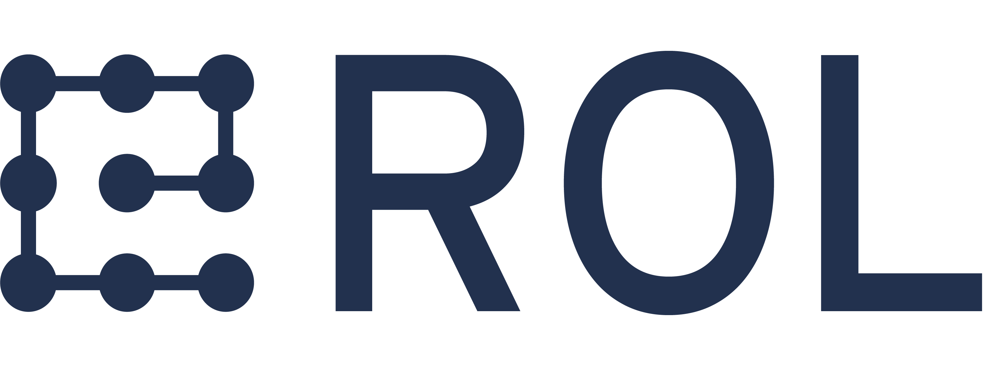

# The Robotics Language

The Robotics Language (RoL) is a high level robotics programming language that generates ROS c++ nodes.


## Install

If you are a user use:
```shell
pip install .
```

If you are a developer use:
```shell
pip install -e .
```

## Examples
You can try the RoL compiler by testing the examples in the folder `RoboticsLanguage/Examples`:

```shell
rol RoboticsLanguage/Examples/helloworld.rol
```

This will create a ROS node in the folder `~/deploy`. If you have installed the catkin workspace at `~/catkin_ws` then you can supply the path to the compiler and compile and launch the node directly:

```shell
rol -p ~/catkin_ws/src/deploy/ RoboticsLanguage/Examples/helloworld.rol -c -l
```

## Docker image

You can test the robotics language using a docker environment. First download a standard ROS distribution

```shell
docker run -it --rm -v `pwd`:/RoL --workdir=/RoL osrf/ros:kinetic-desktop
```

Once inside the docker container you can source the file `run_in_docker.sh`:


```shell
source source_in_docker.sh
```

This will perform a number of steps and eventually will compile the example node `hello_world`.
To launch this node run:

```shell
roslaunch hello_world hello_world.launch
```

## Acknowledgements

The Robotics Language is developed by Robot Care Systems B.V. (http://www.robotcaresystems.com) with the support of the **ROSIN project** (http://rosin-project.eu) and the **European Commission**. We kindly thank their support.

This project has received funding from the European Union’s Horizon 2020 research and innovation programme under grant agreement No. 732287

<image src="http://rosin-project.eu/wp-content/uploads/2017/03/Logo_ROSIN_CMYK-Website.png" />
<br><br>
<image src="https://europa.eu/european-union/sites/europaeu/files/docs/body/flag_yellow_low.jpg" width=200/>
