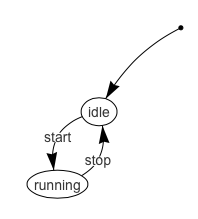

# Finite State Machines tutorial - 1. Defining a language and creating a parser


## Defining a language
The first step is to create a language that can represent the finite state machine object. Ideally such a language should be as simple to interpret as possible. Normally, finite state machines are represented graphically:



In this example there exist two states "idle" and "running", together with two transitions "start" and "stop". The initial state is "idle", represented by the state with an incoming arc from the dot.

A first attempt at defining a language can be for example:

```
(idle)-start->(running)
```

This represents two states with the notation `(state)` connected by a transition `-transition->`.

The complete machine illustrated above is then
```
(idle)-start->(running)
(running)-stop->(idle)
```
In addition to this information one needs to define the initial state and give a name to the finite state machine. An example language can be:

```
name:myMachine
initial:idle

(idle)-start->(running)
(running)-stop->(idle)
```
This information is be sufficient to create the code that generates and runs a finite state machine.

## Parsing the language

To parse the language defined above we use the [Python library Parsley](https://github.com/pyga/parsley). For in-depth information on designing grammars for languages please see the [parsley tutorials](https://parsley.readthedocs.io/en/latest/).

### Creating a RoL input plugin

We start by creating an input plugin for RoL where the parsing will happen. To achieve that we can use `rol` in command line to generate a template:

```bash
rol --create-input-template "My Finite State Machine" -o Developer
```

`rol` should return the message `Created Inputs plugin "MyFiniteStateMachine" in folder ~/.rol/plugins/Inputs/MyFiniteStateMachine`.

You can now open the folder `~/.rol/plugins/Inputs/MyFiniteStateMachine` with your favourite editor to see its structure:

```
.
├── Documentation
│   ├── README.md
│   ├── Reference.md
│   └── Tutorials.md
├── ErrorHandling.py
├── Examples
│   └── MyFiniteStateMachine.rol
├── Language.py
├── Manifesto.py
├── Messages.py
├── Parameters.py
├── Parse.py
├── README.md
├── Tests
│   └── test_MyFiniteStateMachine.py
└── __init__.py
```
Open the file `Parse.py` and you will notice that there is already a language defined. We will modify this language to fit our needs. You can compile the example by typing:

```bash
rol ~/.rol/plugins/Inputs/MyFiniteStateMachine/Examples/MyFiniteStateMachine.rol --remove-cache -c
```

The flag `--remove-cache` is important to make `rol` find the new package. You can also type

```bash
rol --info --remove-cache
```

To make sure your package is installed:

```
The Robotics Language version: 0.2
Inputs:
  MyFiniteStateMachine (0.0.0) *
  ...
```


### The grammar

The Input plugin template defines the following grammar in the file `Parser.py`:

```python
grammar_definition = """
word = <letter+>

name = ws 'word' ws ':' ws word:w ws -> xml('word', text=w)
"""
```

The text `word = <letter+>` defines a rule that states that `word` is a concatenation of 1 or more letters.

The text `name = ws 'word' ws ':' ws word:w ws -> xml('word', text=w)` represents a more complicated rule:

 - `ws` means white space.
 - `word:w` means that the matched word is saved in the variable `w`.
 - `->` represents that action: an XML block is returned with the tag `word` and the inside text is the content of the variable `w`.
For example the text `name: hello` matches the rule, and the result is `<word>hello</word>`

Make sure to look at the [parsley tutorials](https://parsley.readthedocs.io/en/latest/).


We can modify the grammar to include the definition of the machine name and the initial state:
```python
grammar_definition = """
word = <letter+>

name = 'name' ws ':' ws word:n -> xml('name',n)

initial = 'initial' ws ':' ws word:state -> xml('initial',state)
"""
```

Next we create the grammar for `(state)-transition->(state)`:


```
state = '(' ws word:state ws ')' -> xml('state', text=state)

transition = state:begin ws '-' ws word:transition ws '->' state:end -> xml('transition', [begin, end] {'name':transition})
```
